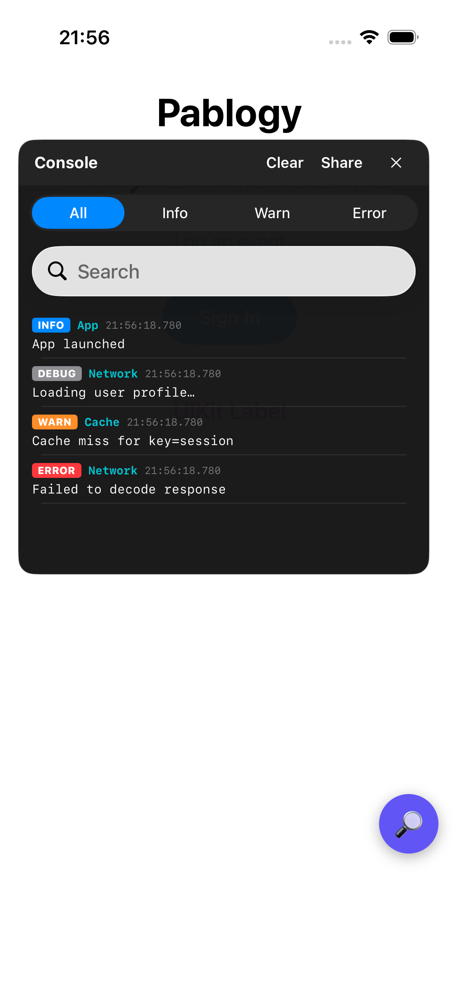

<div align="center">


# Pala

**A floating in-app debug hub for iOS.** Tap the 🔎 bubble to open a tool menu:
inspect any element, log to an in-app console, and overlay grids / frames / touches —
all without leaving your app.

A lightweight, zero-dependency debugging toolkit for iOS.


</div>

---

## Screenshots

| Debug hub menu | UI Inspector (browse) | Console | Layout overlays |
|:---:|:---:|:---:|:---:|
|  |  |  |  |

---

## Tools

A draggable **🔎 bubble** sits above your app. Tap it for the menu:

- **🎯 UI Inspector** — enter inspect mode, then tap elements to browse their
  **frame · font · color name · padding · layer** info **without firing the app's own
  actions**. Step overlapping layers with `◀ i/n ▶`; tap **✕** to exit.
  Reads UIKit views directly, un-annotated SwiftUI via the **accessibility tree**, and
  drawn images/shapes via **CALayer hit-testing**.
- **🌈 Inspect all** — outline every element with a colored rectangle and write its
  properties inline next to it, all at once.
- **📋 Console** — a floating, draggable log viewer with level badges, category, search,
  filter, clear and share. Log from anywhere with `Pala.log(...)`.
- **▦ Grid** — a precision alignment grid overlay.
- **⬚ Show frames** — outline every on-screen view's frame, live.

Zero dependencies. DEBUG-only. Compiles only where UIKit is available.

---

## Installation (Swift Package Manager)

### In Xcode

1. **File ▸ Add Package Dependencies…**
2. Paste the URL:
   ```
   https://github.com/ekucet/Pala.git
   ```
3. Set **Dependency Rule → Up to Next Major Version** and enter `4.0.0`.
   > ⚠️ If the dialog defaults to **Branch → main**, that's Xcode remembering a previous
   > choice. Switch the dropdown to *Up to Next Major Version* (or run **File ▸ Packages
   > ▸ Reset Package Caches** and re-add) so you always get the latest tagged release.
4. **Add Package** → add the **Pala** library to your app target.

### In `Package.swift`

```swift
.package(url: "https://github.com/ekucet/Pala.git", from: "4.0.0"),
// then, in your target dependencies:
.product(name: "Pala", package: "Pala"),
```

> **Tip:** enable it only inside `#if DEBUG` so it never ships in Release builds.

---

## Usage

### SwiftUI

```swift
import SwiftUI
import Pala

@main
struct MyApp: App {
    var body: some Scene {
        WindowGroup {
            ContentView()
            #if DEBUG
                .enablePala()          // shows the floating 🔎 bubble
            #endif
        }
    }
}
```

### UIKit

```swift
import Pala

func application(_ app: UIApplication,
                 didFinishLaunchingWithOptions opts: ...) -> Bool {
    #if DEBUG
    Pala.enable()
    #endif
    return true
}
```

Turn it off with `Pala.disable()`.

### Logging to the Console tool

```swift
Pala.info("User signed in", category: "Auth")
Pala.warning("Cache miss", category: "Cache")
Pala.error("Request failed: \(error)", category: "Network")
Pala.debug("payload=\(payload)")
```

---

## Precise font/color for pure SwiftUI (`.palaInspect`)

**SwiftUI `Text` is not backed by a `UILabel`** — it's drawn with CoreGraphics, so no
public API exposes its resolved font. Un-annotated elements are still identified
automatically (frame · label · role via accessibility, shown with an **A11y** badge),
but for exact typography/color attach metadata:

```swift
Text("Sign In")
    .font(.headline)
    .foregroundColor(.white)
    .padding(.vertical, 14).padding(.horizontal, 32)
    .background(Color.blue)
    .palaInspect("Sign In Button",
                    font: .preferredFont(forTextStyle: .headline),
                    textColor: .white,
                    background: .systemBlue,
                    padding: UIEdgeInsets(top: 14, left: 32, bottom: 14, right: 32))
```

---

## Architecture

| Component | Responsibility |
|---|---|
| `Pala` | Public API: `enable()` / `disable()` / `log(...)`. |
| `PalaHub` | The passthrough overlay window, the draggable bubble, the tool menu, and the grid/frames/touch overlays. |
| `InspectorController` | Presents the UI Inspector (inspect mode + inspect-all). |
| `ViewInspector` | Gathers candidates from every source (SwiftUI registry, accessibility, CALayer, UIKit chain) and ranks them by area + information richness. |
| `PalaConsole` / `ConsolePanelView` | Log store + the floating console viewer. |
| `LayoutTools` | Grid, all-frames, and touch-indicator overlays. |

The hub window passes touches through to your app except on its own controls, and the
inspector overlay is shown **without** becoming key, so it never disturbs your app's
first responder or keyboard.

---

## Example app

`Example/` contains a runnable demo plus UI tests that drive the hub. The Xcode project
is generated (not committed):

```bash
cd Example
ruby gen_project.rb        # requires: gem install xcodeproj
xcodebuild test -project Example.xcodeproj -scheme Example \
  -destination 'platform=iOS Simulator,name=iPhone 17 Pro'
```

---

## Requirements

- iOS 16+
- Swift 5.9+
- UIKit-based apps, or SwiftUI apps built on top of UIKit

## Credits

Design inspired by the strengths of several great debugging tools — a floating tool hub
([DebugSwift](https://github.com/DebugSwift/DebugSwift)), layout/render overlays
([Loupe](https://github.com/Aeastr/Loupe)), a floating log console
([DebugViewer](https://github.com/istsest/DebugViewer-for-SwiftUI)), and runtime panels
([DebugTweak](https://github.com/istsest/DebugTweak-for-SwiftUI)).

## License

MIT © 2026 Erkam Kucet — see [LICENSE](LICENSE).
