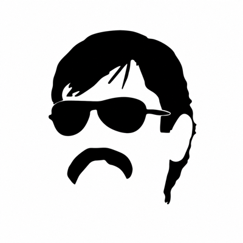
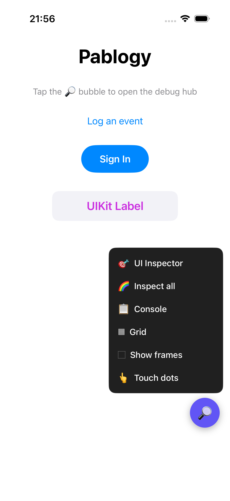
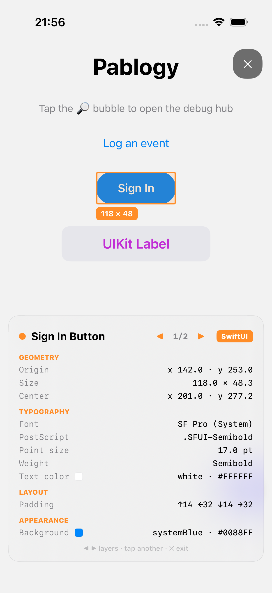
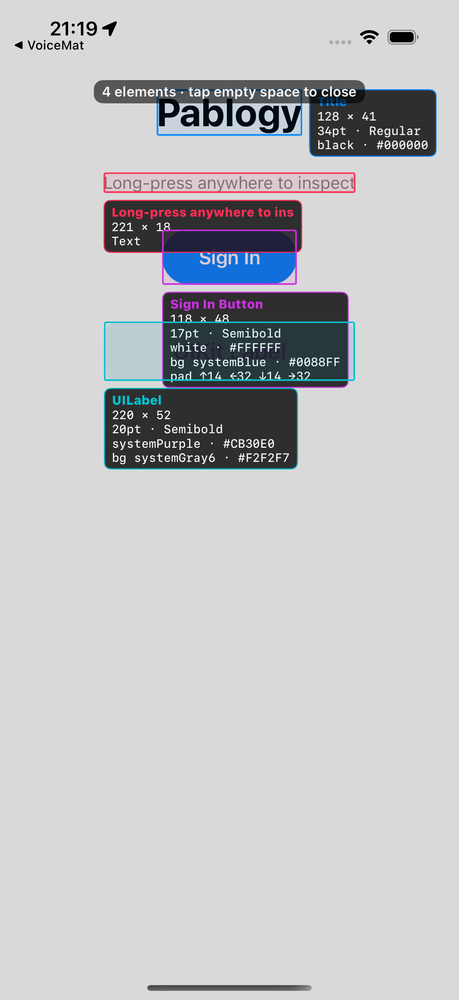
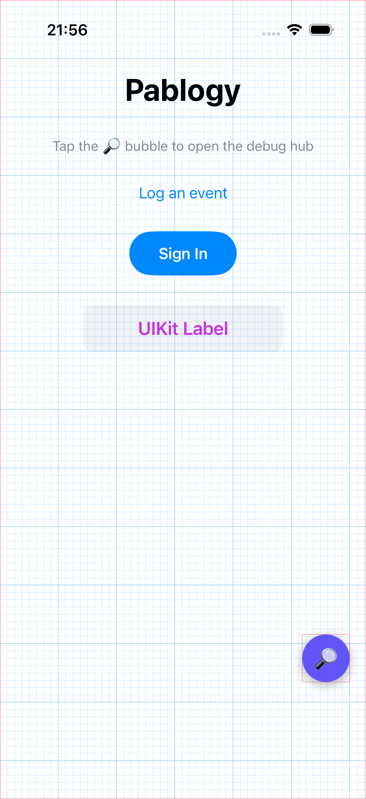
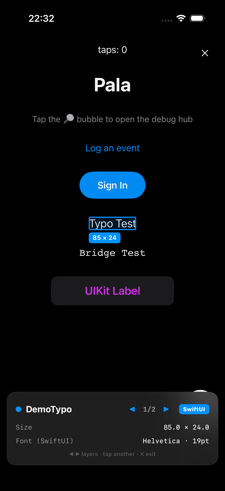
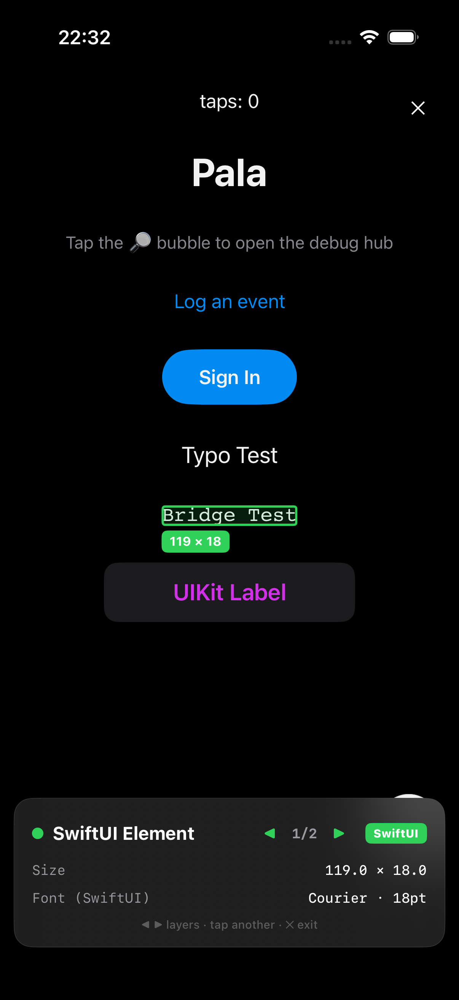

<div align="center">



# Pala

### *Only the dead see it.*

**A floating in-app debug hub for iOS.**
Tap the **Pala** bubble to open a tool menu — inspect any element's font, color and
layout, outline every view, and drop alignment grids — all without leaving your app.

Lightweight, **zero-dependency**, drop-in. One import, one call.


</div>

---

## Screenshots

| Debug hub menu | UI Inspector (browse) | Inspect all | Layout overlays |
|:---:|:---:|:---:|:---:|
|  |  |  |  |

---

## What it does

A draggable **Pala bubble** floats above your app. Tap it for the menu:

- **🎯 UI Inspector** — enter inspect mode, then tap elements to browse their
  **size · font · color · padding · layer** info **without firing the app's own actions**.
  Step through overlapping layers with `◀ 1/n ▶`; tap **✕** to exit. Reads UIKit views
  directly, un-annotated SwiftUI via the **accessibility tree**, and drawn images/shapes
  via **CALayer hit-testing**.
- **🌈 Inspect all** — outline every element with a colored rectangle and write its
  properties inline, all at once.
- **▦ Grid** — a precision alignment grid overlay.
- **⬚ Show frames** — outline every on-screen view's frame, live.

Log structured events from anywhere with `Pala.log(...)`. The bubble menu shows the
running **version** so you can confirm a fresh build is installed.

> **Smart placement** — the menu opens **upward** from the bubble by default, but flips
> **downward** when the bubble is near the top of the screen, and shifts **left / right**
> to stay fully on-screen wherever you drag the bubble.

Zero dependencies · DEBUG-only · compiles only where UIKit is available.

---

## Installation (Swift Package Manager)

### In Xcode

1. **File ▸ Add Package Dependencies…**
2. Paste the URL:
   ```
   https://github.com/ekucet/pala.git
   ```
3. Set **Dependency Rule → Up to Next Major Version** and enter `1.0.0`.
   > ⚠️ If the dialog defaults to **Branch → main**, that's Xcode remembering a previous
   > choice. Switch it to *Up to Next Major Version* (or **File ▸ Packages ▸ Reset Package
   > Caches** and re-add) so you always get the latest tagged release.
4. **Add Package** → add the **Pala** library to your app target.

### In `Package.swift`

```swift
.package(url: "https://github.com/ekucet/pala.git", from: "1.0.0"),
// then, in your target dependencies:
.product(name: "Pala", package: "pala"),
```

> **Tip:** gate it behind `#if DEBUG` so it never ships in Release builds.

---

## Usage

### SwiftUI

```swift
import SwiftUI
import Pala

@main
struct MyApp: App {
    var body: some Scene {
        WindowGroup {
            ContentView()
            #if DEBUG
                .enablePala()      // shows the floating Pala bubble
            #endif
        }
    }
}
```

### UIKit

```swift
import Pala

func application(_ app: UIApplication,
                 didFinishLaunchingWithOptions opts: ...) -> Bool {
    #if DEBUG
    Pala.enable()
    #endif
    return true
}
```

Turn it off with `Pala.disable()`. Record logs with:

```swift
Pala.info("User signed in", category: "Auth")
Pala.warning("Cache miss", category: "Cache")
Pala.error("Request failed: \(error)", category: "Network")
```

---

## Precise font & color for pure SwiftUI

**SwiftUI `Text` is not backed by a `UILabel`** — it's drawn into a `CALayer`, so no
public API exposes its resolved font. Un-annotated elements are still identified
automatically (size · label · role via accessibility), but for **exact typography and
color** attach metadata with `.palaInspect`:

```swift
Text("Sign In")
    .font(.headline)
    .foregroundColor(.white)
    .palaInspect("Sign In Button",
                 font: .headline,          // reflected → "System · 17pt · semibold"
                 textColor: .white,
                 background: .systemBlue)
```

| Reflected SwiftUI font | Fed from a design system (no `import Pala`) |
|:---:|:---:|
|  |  |

### Colors, by name

Register your palette once and the inspector prints the **token name** instead of a
bare hex — everywhere it resolves a color:

```swift
#if DEBUG
Pala.registerColors([
    ("Primary6",         UIColor(named: "Primary6")!),
    ("TextLightPrimary", UIColor(named: "TextLightPrimary")!),
])
#endif
// inspector now shows:  Primary6 · #0F62FE
```

A registered token wins over the system color it happens to resemble.

And because SwiftUI `Text` exposes **no** color property, tapping one still reports a
**Color** row, sampled from the rendered pixels — the ink you actually see, right next
to the font. Pala reads a per-text bitmap layer when there is one, and otherwise renders
the element's region and separates the glyphs from the background. Either way it works
no matter how the color was applied (`foregroundColor`, `foregroundStyle`, or your own
modifier).

> Sampled colors are read back from rendered pixels, so antialiasing can shift them by a
> shade (`#FEFEFE` for pure white) and alpha is not recovered.

---

## Feeding the inspector from a design system (no import)

If your fonts come from a shared **design-system package**, you don't want it to depend
on a debug tool. Pala keeps its metadata in a **process-global store** (an associated
object on `UIApplication`, keyed by an interned selector, holding only Foundation/UIKit
values). Any module can write to that store **without importing Pala**, and the hub reads
it as if `.palaInspect` had been applied.

This lets a `TypographyModifier` surface every styled view's font in the inspector while
keeping the design system dependency-free. Toggle it on from the app (which reliably
knows its own build config), since SwiftPM package targets don't always receive `DEBUG`
under custom build configurations.

See [`Example/App/ContentView.swift`](Example/App/ContentView.swift) (`PalaFontBridge`)
for the ~20-line bridge and the exact store shape.

---

## Architecture

| Component | Responsibility |
|---|---|
| `Pala` | Public API: `enable()` / `disable()` / `log(...)`. |
| `PalaHub` | Passthrough overlay window, the draggable bubble, the smart-positioned tool menu, and the grid/frames overlays. |
| `InspectorController` | Presents the UI Inspector (inspect mode + inspect-all). |
| `ViewInspector` | Gathers candidates from every source (SwiftUI registry, accessibility, CALayer, UIKit chain) and ranks them by area + information richness. |
| `InspectorRegistry` | The process-global metadata store shared across every linked copy of Pala. |
| `LayoutTools` | Grid and all-frames overlays. |

The hub window passes touches through to your app except on its own controls, and the
inspector overlay is shown **without** becoming key — so it never disturbs your app's
first responder or keyboard.

---

## Example app

`Example/` contains a runnable demo plus UI tests that drive the hub (and generate the
screenshots above). The Xcode project is generated, not committed:

```bash
cd Example
ruby gen_project.rb        # requires: gem install xcodeproj
xcodebuild test -project Example.xcodeproj -scheme Example \
  -destination 'platform=iOS Simulator,name=iPhone 17 Pro'
```

---

## Requirements

- iOS 16+
- Swift 5.9+
- UIKit-based apps, or SwiftUI apps built on top of UIKit

## License

MIT © 2026 Erkam Kucet — see [LICENSE](LICENSE).
